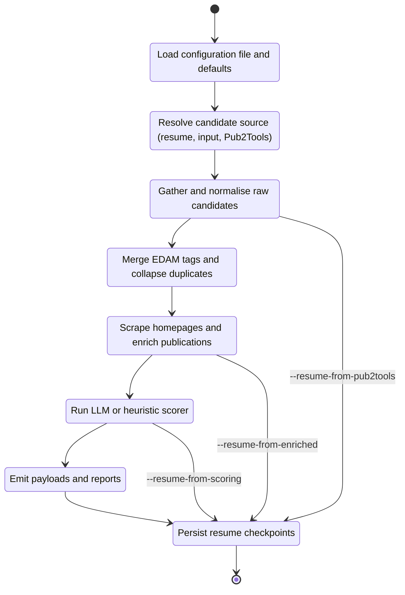
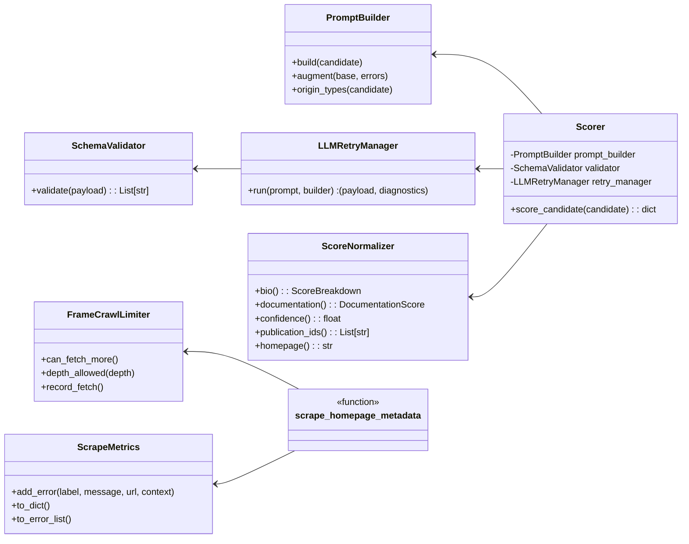
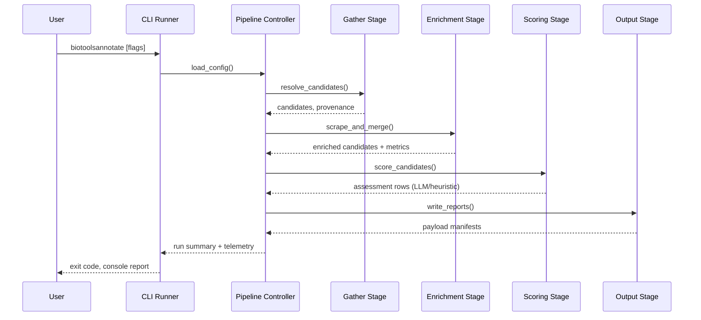

# Architecture and Data Flow

This document provides a high-level overview of how the CLI pipeline processes candidates and how the main modules collaborate. The diagrams use [Mermaid](https://mermaid.js.org/) so they render inline on GitHub and within most Markdown viewers.

## Pipeline Data Flow

```mermaid
flowchart LR
    subgraph Gather
        P2T["Pub2Tools Export\n(to_biotools.json)"]
        CLIInput["User Input\n(--input / --resume)"]
        Registry["Registry Snapshot\n(optional)"]
        Load["load_candidates"]
        P2T --> Load
        CLIInput --> Load
        Registry -.-> Load
    end

    subgraph Deduplicate
        Load --> Dedup["merge_edam_tags + dedup"]
    end

    subgraph Enrich
        Dedup --> Scrape["Homepage Scraper\n(enrich.scraper)"]
        Scrape --> EuropePMC["Europe PMC Enrichment"]
        EuropePMC --> Cache["cache/enriched_candidates.json.gz"]
    end

    subgraph Score
        Cache --> ScoreOne["ThreadPoolExecutor\nscore_one()
 -- offline? --> HeuristicScorer"]
        ScoreOne -->|LLM healthy| LLMScorer["Scorer (Ollama)"]
        ScoreOne -->|offline/LLM failure| HeuristicScorer["Heuristic scoring"]
        LLMScorer --> Reports
        HeuristicScorer --> Reports
    end

    subgraph Output
        Reports["reports/assessment.jsonl + .csv"] --> Decisions["decision rows"]
        Decisions --> PayloadAdd["exports/biotools_payload.json"]
        Decisions --> PayloadReview["exports/biotools_review_payload.json"]
        Decisions --> Entries["exports/biotools_entries.json"]
    end
```

## Run Lifecycle

## Module Collaboration

## Stage Coordination Sequence

## Key Notes
- **Telemetry**: `LLMRetryManager` returns `RetryDiagnostics` and `ScoreNormalizer` adds weighted documentation scores so the JSONL output now records `model_params.attempts`, `model_params.schema_errors`, and `model_params.prompt_augmented` when retries occur.
- **Shared utilities**: `FrameCrawlLimiter` and `ScrapeMetrics` keep homepage scraping bounded while retaining rich error context for the pipeline status panel.
- The diagrams highlight only the core pipeline nodes. Supporting modules (configuration loading, CLI parsing, registry helpers) follow the same modular pattern and are omitted for brevity.
